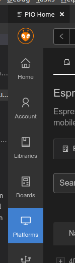
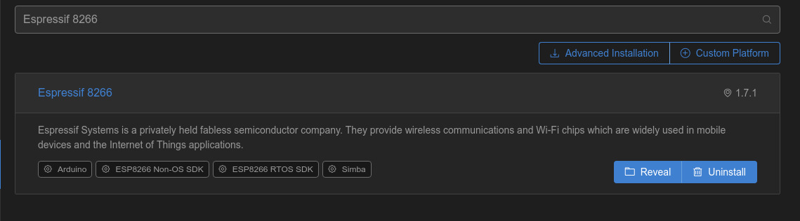
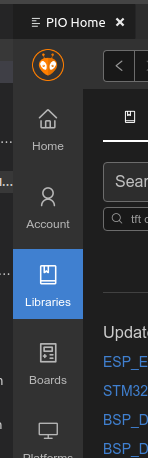
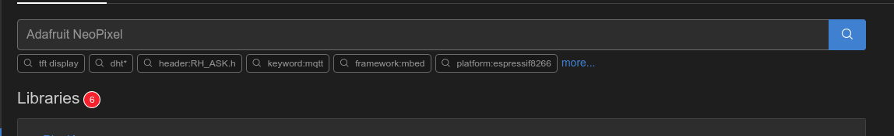
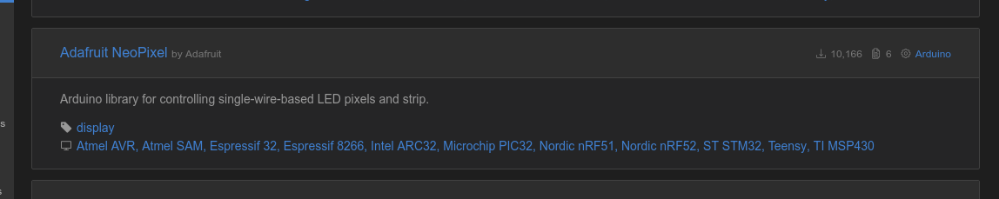

## DustFishing

LED animation for THE dust fishing stand.

Designed for WS2812B led ribbon and WEMOS D1 miniPro.

### Getting started

This project was built using [VSCode](https://code.visualstudio.com/) and [PlatformIO](https://platform.io/). We assume you have both installed. If it's not the case, follow [install PlatformIO for VSCode](http://docs.platformio.org/en/latest/ide/vscode.html).

Open VSCode.

#### Install the Espressif 8266

In the plaform section of platformio,

and search and install "Espressif 8266"

#### Install the Adafruit NeoPixel

In the libraries section of PlatformIO,

search for "Adafruit NeoPixel"

and install it.

#### Build

Run `Tasks: Run Task` and select `PlaformIO: Build (d1_mini)`.

#### Upload to the board

Assuming your board is connected and detected by PlatformIO, run `Tasks: Run Task` and select `PlaformIO: Upload (d1_mini)`. Enjoy!

### Troubleshooting
